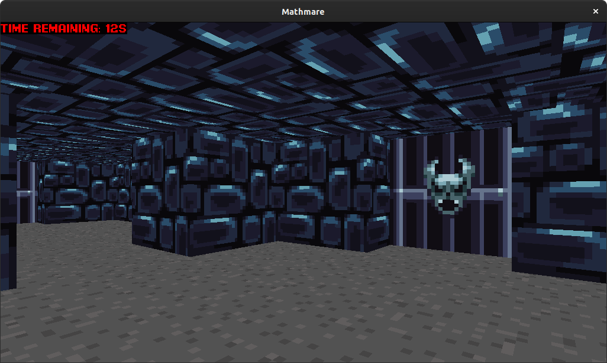
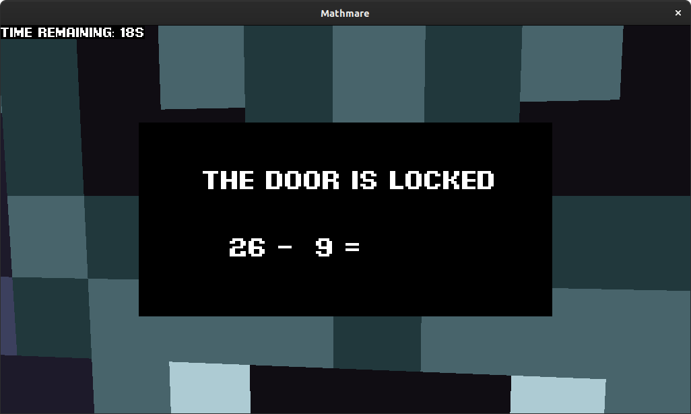
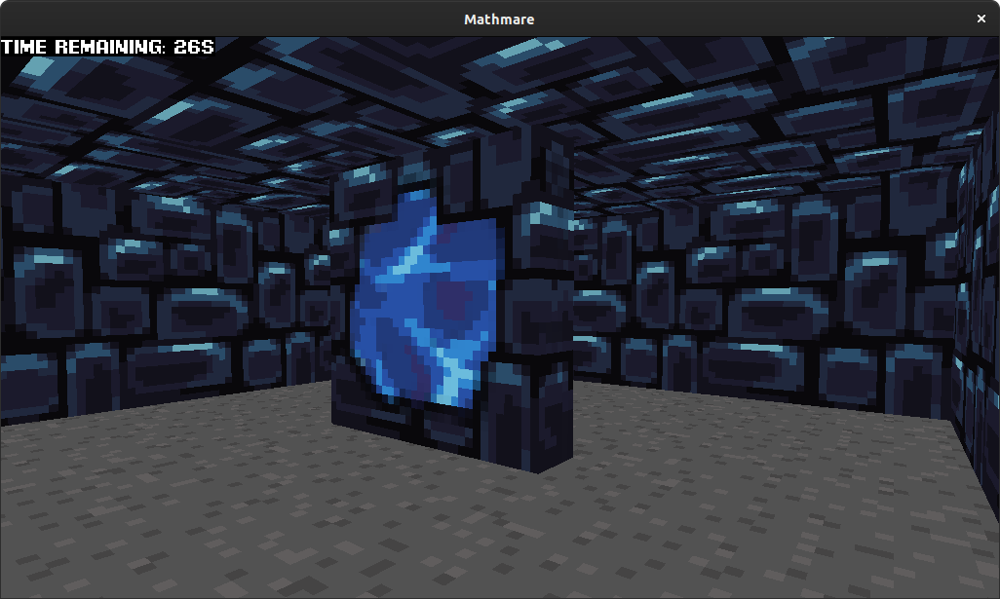

# Game MATHMARE

It is simple OpenGL school project game. 

## Gameplay

A player tries to escape from 3D dungeon where he/she must solve simple math expressions in limited time to unlock doors
to get to the exit portal. If certain expression is correctly solved time bonus is added to player, but if expression is
not solved some time is removed from player's remaining time.

## Technologies

The game was built in Java using [LWJGL](https://www.lwjgl.org/) library with help of school's own libraries 
[transforms](https://gitlab.com/honza.vanek/transforms) and [utils](https://gitlab.com/Bruno.Jezek/lwjgl-utils).

## Graphics

Textures are by artist [Jestan](https://jestan.itch.io/pixel-texture-pack).

## Build

Project uses Maven, so to build executable jar file simply run `mvn clean install`. 
